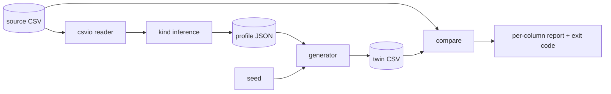

# datadouble

[English](README.md) | [中文](README.zh.md) | [日本語](README.ja.md)

[](LICENSE) [](CHANGELOG.md) [](pyproject.toml)  [](CONTRIBUTING.md)

**CSV の合成双子を生成——列ごとの分布と欠損率はそのまま、あなたの実データは一切含まない。シード指定可・オフライン・依存ゼロ。**


```bash
git clone https://github.com/JaydenCJ/datadouble && cd datadouble && pip install -e .
```

> **プレリリース：** datadouble はまだ PyPI に公開されていません。初回リリースまでは [JaydenCJ/datadouble](https://github.com/JaydenCJ/datadouble) をクローンし、リポジトリ直下で `pip install -e .` を実行してください。

## なぜ datadouble？

「データを共有してもらえますか？」——「無理です」。このやり取りが毎週、デモもバグ報告もベンダーチケットも止めています。既存の逃げ道はどれも痛い：SDV 系のシンセサイザーは優秀ですが、モデル学習の工程と深層学習の依存スタックを抱え込み、プライバシーチームの監査対象が増えます。Faker はもっともらしいスキーマをでっち上げるだけで、*あなたの*データとは無関係——再現したいバグは消えてしまいます。手作業のマスキングは何時間もかかる上、見落とした値はそのまま漏れます。datadouble は地味で監査しやすい中間路線を取ります：各列を小さな統計プロファイル（分位点グリッド・値の頻度表・構造マスク）に要約し、シード付き乱数ストリームでそこから新しい行を再生成します。モデルなし、ネットワークなし、審査すべき依存なし——ツール全体が読み通せる標準ライブラリ Python です。

|  | datadouble | SDV | Faker | 手作業マスキング |
|---|---|---|---|---|
| *あなたの*列の分布と欠損率に一致 | はい（経験分布） | はい（学習モデル） | いいえ（架空スキーマ） | ときどき |
| 自由記述の値が出力に漏れる可能性 | 皆無——テキストは構造マスクに還元 | 設定次第で起こり得る | いいえ | しばしば、静かに |
| 導入コスト | コマンド 1 つ | テーブルごとにモデル学習 | プロバイダを手書き | テーブルごとに数時間 |
| シードから決定的に再現 | はい、バイト単位で一致 | 既定では不可 | はい | 対象外 |
| ランタイム依存 | 0 | 直接 14 個、torch 一式を含む | 0 | 対象外 |

<sub>依存数は PyPI 上で宣言されたランタイム要件（2026-07 時点）：sdv 1.x は 14 個（ctgan/deepecho が PyTorch を連鎖的に引き込む）。datadouble の数字は [pyproject.toml](pyproject.toml) の `dependencies = []` を参照。</sub>

## 特長

- **列ごとの分布に忠実** —— 数値と日付は経験分位点グリッドの逆変換で再サンプリング（歪みも裾の重さも保持）、カテゴリ列は正確な頻度表から、自由テキストは構造マスクから生成（`ORD-2041` → `AAA-9999` → `QPI-5515`）。
- **欠損率に正直** —— 各列の欠損率*と*欠損の書き方（`""`、`NA`、`null` など）を双子へ引き継ぎます。
- **シード付き・バイト単位で一致** —— 同じプロファイル + シード + 行数なら、どのマシンでも同一バイトを出力。行数を増やしても接頭辞は安定：1 万行双子の先頭 1000 行は 1000 行双子と一致します。
- **二成果物ワークフロー** —— データから派生するのは JSON プロファイルだけ。それを相手に渡せば、`datadouble generate` が原本を見ずに双子を再構築します。
- **ドリフト採点を内蔵** —— `datadouble compare` は列ごとの距離レポートを出力し、双子（や任意の表）が許容差を超えると終了コード 1 で終わるため、そのまま CI に組み込めます。
- **依存ゼロ・完全オフライン** —— 標準ライブラリのみ、テレメトリなし、データがマシンの外へ出ることはありません。

## クイックスタート

インストール：

```bash
git clone https://github.com/JaydenCJ/datadouble && cd datadouble && pip install -e .
```

同梱のサンプル表から双子を作って採点します（出力は実際の実行から転記）：

```bash
datadouble twin examples/orders.csv -o twin.csv --seed 42
head -4 twin.csv
datadouble compare examples/orders.csv twin.csv
```

```text
wrote twin.csv (200 rows, 8 columns, seed 42)
order_id,created,region,status,amount,qty,email,coupon
QPI-5515,2026-04-24,west,refunded,78.66,5,ajrv@ygaoeop.tdie,
CVY-1394,2026-04-20,east,paid,78.85,1,vitz@ulowjth.smee,
FAW-2900,2026-04-30,north,paid,60.27,2,idg2@exkdlyr.nyta,
column    type         nulls a->b    metric         status
--------  -----------  ------------  -------------  ------
order_id  text         0.000->0.000  tv 0.000       ok
created   date         0.000->0.000  q-shift 0.019  ok
region    categorical  0.000->0.000  tv 0.015       ok
status    categorical  0.000->0.000  tv 0.025       ok
amount    float        0.000->0.000  q-shift 0.009  ok
qty       categorical  0.000->0.000  tv 0.035       ok
email     text         0.000->0.000  tv 0.060       ok
coupon    categorical  0.625->0.640  tv 0.058       ok

rows: 200 -> 200
TWIN OK: 8/8 shared columns within tolerance
```

同じ往復を Python なら 5 行で：

```python
from datadouble import build_profile, generate_rows, read_csv, write_csv

header, rows, delimiter = read_csv("orders.csv")
profile = build_profile(header, rows)
twin = generate_rows(profile, rows=len(rows), seed=42)
write_csv("orders_twin.csv", header, twin, delimiter)
print(f"wrote orders_twin.csv ({len(twin)} rows)")
```

データを一切持ち出せない場合はワークフローを分割します：信頼ゾーン内で `datadouble profile data.csv -o profile.json` を実行し、その JSON を目視レビューし（小さくて人間に読めます——[docs/profile-format.md](docs/profile-format.md) 参照）、あとはどこででも `datadouble generate profile.json --rows 500` を実行するだけです。

## 列の種類

| 種類 | 判定条件 | 双子の値の出どころ |
|---|---|---|
| `int` | 非欠損セルがすべて素の整数（ゼロ埋めなし） | 分位点グリッドの逆変換を丸め |
| `float` | すべてのセルが小数か指数表記のリテラル | 分位点グリッドの逆変換、元の小数精度を保持 |
| `date` / `datetime` | 1 つの strftime 形式が全セルを解析できる | 序数/エポック秒の分位点グリッド、同じ形式で出力 |
| `categorical` | 相異値が少ない（≤ `--cat-cap` かつ相対基数が低い） | 正確な値の頻度表 |
| `text` | それ以外すべて | 構造マスク表 + 新規ランダム文字での充填 |
| `empty` | すべてのセルが欠損トークン | 観測された欠損トークン |

チューニングと許容差：

| キー | 既定値 | 効果 |
|---|---|---|
| `--seed` | `0` | 乱数シード；同一シードの双子はバイト単位で一致 |
| `--rows` | 元表の行数 | 生成する行数 |
| `--bins` | `32` | 数値/時間列の分位点グリッド解像度 |
| `--cat-cap` | `32` | 相異値がこれを超えるとテキストマスクへ退避 |
| `--delimiter` | 自動判別 | 入力の区切り文字（`,` `;` タブ `\|` を判別） |
| `--max-shift` | `0.10` | `compare`：許容する正規化分位点シフト |
| `--max-tv` | `0.15` | `compare`：許容する全変動距離 |
| `--max-null-delta` | `0.05` | `compare`：許容する欠損率差 |

## プライバシーモデル

プロファイルが何を保持するかを正確に。自由記述や高基数の列（ID・メール・氏名・住所）は**カウント付きの構造マスクとしてのみ**保存されます——具体的な文字列がプロファイルに入ることはなく、マスク表には上限があるため、一度きりの値の形状は記録されず捨てられます。数値・時間列は経験分布の分位点を最大 `bins + 1` 点だけ保存します。**低基数のカテゴリ値はそのまま複製されます**（`status=paid` の双子が役に立つのはこのため）。カテゴリ自体が機微なら `--cat-cap` を下げて列をマスクテキスト側へ倒してください。v0.1.0 では各列を独立にモデル化しており、列間相関は意図的に保持しません——忠実度の限界であると同時にプライバシー上の利点でもあります。datadouble は実務的な非識別化ツールであり、差分プライバシーのシステムではありません。共有前にプロファイルを、墨消し文書を確認するのと同じ姿勢でレビューしてください。

## 検証

このリポジトリは CI を同梱しません。上記の主張はすべてローカル実行で検証しています。このリポジトリのチェックアウトから再現できます：

```bash
pip install -e '.[dev]' && pytest && bash scripts/smoke.sh
```

出力（実際の実行から転記、`...` で省略）：

```text
95 passed in 4.65s
...
[compare] TWIN OK: 8/8 shared columns within tolerance
SMOKE OK
```

## アーキテクチャ



## ロードマップ

- [x] 型推論、分位点/頻度/マスクのプロファイル、シード付き接頭辞安定生成、ドリフト比較、4 サブコマンド CLI（v0.1.0）
- [ ] PyPI 公開（`pip install datadouble`）
- [ ] 列間相関の保持（ペアワイズ copula）をフラグで提供
- [ ] メモリを超える CSV 向けのストリーミングプロファイラ
- [ ] ユーザー指定の strftime 形式と列ごとの型上書き

全リストは [open issues](https://github.com/JaydenCJ/datadouble/issues) を参照してください。

## コントリビュート

コントリビューション歓迎です——まずは [good first issue](https://github.com/JaydenCJ/datadouble/issues?q=is%3Aissue+is%3Aopen+label%3A%22good+first+issue%22) から、あるいは [discussion](https://github.com/JaydenCJ/datadouble/discussions) を立ててください。開発環境の構築は [CONTRIBUTING.md](CONTRIBUTING.md) を参照。

## ライセンス

[MIT](LICENSE)
