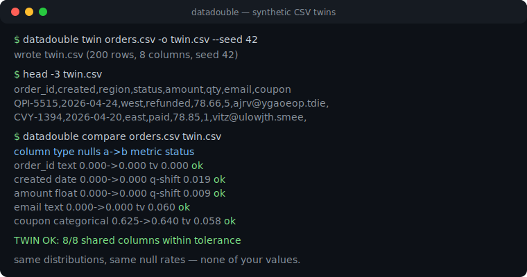
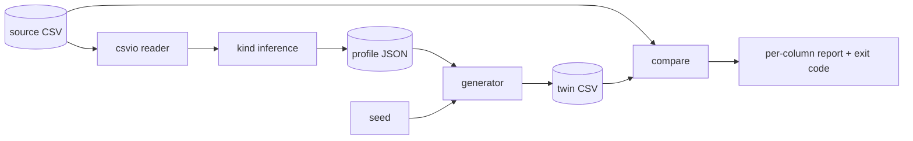

# datadouble

[English](README.md) | [中文](README.zh.md) | [日本語](README.ja.md)

[](LICENSE) [](CHANGELOG.md) [](pyproject.toml)  [](CONTRIBUTING.md)

**Generate a synthetic twin of your CSV — same per-column distributions and null rates, none of your values. Seeded, offline, zero dependencies.**



```bash
git clone https://github.com/JaydenCJ/datadouble && cd datadouble && pip install -e .
```

> **Pre-release:** datadouble is not yet published to PyPI. Until the first release, clone [JaydenCJ/datadouble](https://github.com/JaydenCJ/datadouble) and run `pip install -e .` from the repository root.

## Why datadouble?

"Can you share the data?" — "No." That exchange stalls demos, bug reports, and vendor tickets every week. The existing escape hatches all hurt: SDV-style synthesizers are excellent but drag in a model-training step and a deep-learning dependency stack your privacy team now has to audit; Faker invents a plausible schema that has nothing to do with *your* data, so the bug you are trying to reproduce disappears; hand-scrubbing a sample takes hours and still leaks the values you missed. datadouble takes the boring, auditable middle path: it summarizes each column into a small statistical profile (quantile grid, value frequencies, or structure masks), then regenerates fresh rows from that profile with a seeded random stream. No model, no network, no dependency to vet — the whole tool is readable standard-library Python.

|  | datadouble | SDV | Faker | hand-scrubbed sample |
|---|---|---|---|---|
| Matches *your* columns' distributions and null rates | Yes (empirical) | Yes (fitted model) | No (invented schema) | Sometimes |
| Free-text values can leak into the output | Never — text is reduced to structure masks | Possible without careful config | No | Often, silently |
| Setup cost | one command | model training per table | hand-written providers | hours per table |
| Deterministic from a seed | Yes, byte-identical | Not by default | Yes | n/a |
| Runtime dependencies | 0 | 14 direct, incl. a torch stack | 0 | n/a |

<sub>Dependency counts are declared runtime requirements on PyPI as of 2026-07: sdv 1.x lists 14 (ctgan/deepecho transitively pull in PyTorch). datadouble's count is `dependencies = []` in [pyproject.toml](pyproject.toml).</sub>

## Features

- **Distribution-faithful columns** — numbers and dates are resampled by inverting an empirical quantile grid (skew and heavy tails survive), categories from their exact frequency table, free text from structure masks (`ORD-2041` → `AAA-9999` → `QPI-5515`).
- **Null-rate honest** — each column's missingness rate *and* its null spelling (`""`, `NA`, `null`, ...) carry over to the twin.
- **Seeded, byte-identical output** — same profile + seed + row count gives identical bytes on any machine, and longer runs are prefix-stable: row 1..1000 of a 10,000-row twin equal the 1,000-row twin.
- **Two-artifact workflow** — the JSON profile is the only thing derived from your data; ship it to the other side and `datadouble generate` rebuilds a twin without ever seeing the original.
- **Drift scoring built in** — `datadouble compare` prints a per-column distance report and exits 1 when the twin (or anything else) is out of tolerance, so it slots straight into CI.
- **Zero dependencies, fully offline** — standard library only, no telemetry, nothing ever leaves your machine.

## Quickstart

Install:

```bash
git clone https://github.com/JaydenCJ/datadouble && cd datadouble && pip install -e .
```

Make a twin of the bundled example table and score it (output copied from a real run):

```bash
datadouble twin examples/orders.csv -o twin.csv --seed 42
head -4 twin.csv
datadouble compare examples/orders.csv twin.csv
```

```text
wrote twin.csv (200 rows, 8 columns, seed 42)
order_id,created,region,status,amount,qty,email,coupon
QPI-5515,2026-04-24,west,refunded,78.66,5,ajrv@ygaoeop.tdie,
CVY-1394,2026-04-20,east,paid,78.85,1,vitz@ulowjth.smee,
FAW-2900,2026-04-30,north,paid,60.27,2,idg2@exkdlyr.nyta,
column    type         nulls a->b    metric         status
--------  -----------  ------------  -------------  ------
order_id  text         0.000->0.000  tv 0.000       ok
created   date         0.000->0.000  q-shift 0.019  ok
region    categorical  0.000->0.000  tv 0.015       ok
status    categorical  0.000->0.000  tv 0.025       ok
amount    float        0.000->0.000  q-shift 0.009  ok
qty       categorical  0.000->0.000  tv 0.035       ok
email     text         0.000->0.000  tv 0.060       ok
coupon    categorical  0.625->0.640  tv 0.058       ok

rows: 200 -> 200
TWIN OK: 8/8 shared columns within tolerance
```

The same round trip from Python, in five lines:

```python
from datadouble import build_profile, generate_rows, read_csv, write_csv

header, rows, delimiter = read_csv("orders.csv")
profile = build_profile(header, rows)
twin = generate_rows(profile, rows=len(rows), seed=42)
write_csv("orders_twin.csv", header, twin, delimiter)
print(f"wrote orders_twin.csv ({len(twin)} rows)")
```

When the data cannot leave at all, split the workflow: run `datadouble profile data.csv -o profile.json` inside the trusted zone, review the JSON by eye (it is small and human-readable — see [docs/profile-format.md](docs/profile-format.md)), then run `datadouble generate profile.json --rows 500` anywhere else.

## Column kinds

| Kind | Detected when | Twin values come from |
|---|---|---|
| `int` | every non-null cell is a plain integer (no zero-padding) | quantile-grid inversion, rounded |
| `float` | every cell is a decimal or scientific literal | quantile-grid inversion, original decimal precision |
| `date` / `datetime` | one strftime format parses every cell | quantile grid over ordinals / epoch seconds, same format |
| `categorical` | few distinct values (≤ `--cat-cap`, low relative cardinality) | exact value frequency table |
| `text` | everything else | structure-mask table filled with fresh characters |
| `empty` | every cell is a null token | the observed null token |

Tuning knobs and tolerances:

| Key | Default | Effect |
|---|---|---|
| `--seed` | `0` | random seed; twins are byte-identical per seed |
| `--rows` | source row count | how many rows to generate |
| `--bins` | `32` | quantile grid resolution for numeric/temporal columns |
| `--cat-cap` | `32` | max distinct values before a column falls back to text masks |
| `--delimiter` | sniffed | input field delimiter (`,` `;` tab `\|` are sniffed) |
| `--max-shift` | `0.10` | `compare`: allowed normalized quantile shift |
| `--max-tv` | `0.15` | `compare`: allowed total variation distance |
| `--max-null-delta` | `0.05` | `compare`: allowed null-rate difference |

## Privacy model

Be precise about what a profile keeps. Free-text and high-cardinality columns (IDs, emails, names, addresses) are stored **only as structure masks with counts** — the concrete strings never enter the profile, and mask tables are capped so one-off value shapes are dropped rather than memorialized. Numeric and temporal columns are stored as at most `bins + 1` quantile points of the empirical distribution. **Low-cardinality categorical values are copied verbatim** (that is what makes `status=paid` twins useful); if a category itself is sensitive, lower `--cat-cap` to push the column into masked text. Columns are modeled independently in v0.1.0 — cross-column correlations are deliberately not preserved, which is a fidelity limitation and a privacy feature at once. datadouble is a pragmatic de-identification tool, not a differential-privacy system; review the profile before sharing it, exactly as you would review a redacted document.

## Verification

This repository ships no CI; every claim above is verified by local runs. Reproduce them from a checkout of this repository:

```bash
pip install -e '.[dev]' && pytest && bash scripts/smoke.sh
```

Output (copied from a real run, truncated with `...`):

```text
95 passed in 4.65s
...
[compare] TWIN OK: 8/8 shared columns within tolerance
SMOKE OK
```

## Architecture



## Roadmap

- [x] Kind inference, quantile/frequency/mask profiles, seeded prefix-stable generation, drift comparison, four-command CLI (v0.1.0)
- [ ] PyPI release with `pip install datadouble`
- [ ] Optional cross-column correlation preservation (pairwise copulas) behind a flag
- [ ] Streaming profiler for CSVs larger than memory
- [ ] User-supplied strftime formats and per-column kind overrides

See the [open issues](https://github.com/JaydenCJ/datadouble/issues) for the full list.

## Contributing

Contributions are welcome — start with a [good first issue](https://github.com/JaydenCJ/datadouble/issues?q=is%3Aissue+is%3Aopen+label%3A%22good+first+issue%22) or open a [discussion](https://github.com/JaydenCJ/datadouble/discussions). See [CONTRIBUTING.md](CONTRIBUTING.md) for the development setup.

## License

[MIT](LICENSE)
