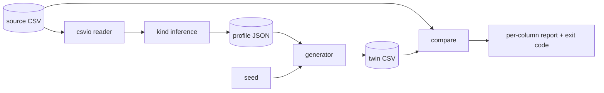

# datadouble

[English](README.md) | [中文](README.zh.md) | [日本語](README.ja.md)

[](LICENSE) [](CHANGELOG.md) [](pyproject.toml)  [](CONTRIBUTING.md)

**为你的 CSV 生成一个合成双胞胎——逐列分布与空值率完全一致，却不含你的任何真实值。可设种子、离线运行、零依赖。**


```bash
git clone https://github.com/JaydenCJ/datadouble && cd datadouble && pip install -e .
```

> **预发布：** datadouble 尚未发布到 PyPI。在首个正式版之前，请克隆 [JaydenCJ/datadouble](https://github.com/JaydenCJ/datadouble) 并在仓库根目录运行 `pip install -e .`。

## 为什么选 datadouble？

“能把数据发我吗？”——“不行。”这段对话每周都在卡住演示、bug 报告和供应商工单。现有的出路各有各的痛：SDV 一类合成器很出色，但要经过模型训练，还拖着一整套深度学习依赖，隐私团队得逐个审计；Faker 凭空编造一个像样的 schema，却和*你的*数据毫无关系，你想复现的 bug 就此消失；手工脱敏一份样本要花几个小时，漏掉的值照样泄露。datadouble 走的是朴素、可审计的中间路线：把每一列压缩成一份小小的统计画像（分位数网格、取值频率表或结构掩码），再用带种子的随机流从画像重新生成全新行。没有模型、没有网络、没有需要审查的依赖——整个工具就是可通读的标准库 Python。

|  | datadouble | SDV | Faker | 手工脱敏样本 |
|---|---|---|---|---|
| 贴合*你的*列分布与空值率 | 是（经验统计） | 是（拟合模型） | 否（凭空 schema） | 有时 |
| 自由文本值可能泄漏到输出 | 绝不——文本被归约为结构掩码 | 配置不当时可能 | 否 | 经常且无声 |
| 上手成本 | 一条命令 | 每张表都要训练模型 | 手写 provider | 每张表数小时 |
| 由种子决定、可复现 | 是，逐字节一致 | 默认不是 | 是 | 不适用 |
| 运行时依赖 | 0 | 直接依赖 14 个，含 torch 全家桶 | 0 | 不适用 |

<sub>依赖数为 PyPI 上声明的运行时依赖（统计于 2026-07）：sdv 1.x 列出 14 个（ctgan/deepecho 会传递引入 PyTorch）。datadouble 的数字见 [pyproject.toml](pyproject.toml) 中的 `dependencies = []`。</sub>

## 功能特性

- **逐列分布保真** —— 数字与日期通过反演经验分位数网格重采样（偏态与长尾都保留），类别列按精确频率表重采样，自由文本按结构掩码生成（`ORD-2041` → `AAA-9999` → `QPI-5515`）。
- **空值率诚实** —— 每列的缺失率*以及*空值写法（`""`、`NA`、`null` 等）都会带到双胞胎里。
- **有种子、逐字节一致** —— 相同画像 + 种子 + 行数在任何机器上产出完全相同的字节；行数加长时前缀稳定：一万行双胞胎的前 1000 行等于千行双胞胎。
- **两件套工作流** —— JSON 画像是唯一从数据派生的产物；把它交给对方，`datadouble generate` 无需见到原始数据就能重建双胞胎。
- **内置漂移评分** —— `datadouble compare` 打印逐列距离报告，双胞胎（或任何表）超出容差即以退出码 1 结束，可直接接入 CI。
- **零依赖、完全离线** —— 仅用标准库，无遥测，任何数据都不会离开你的机器。

## 快速上手

安装：

```bash
git clone https://github.com/JaydenCJ/datadouble && cd datadouble && pip install -e .
```

为内置示例表生成双胞胎并打分（输出摘自真实运行）：

```bash
datadouble twin examples/orders.csv -o twin.csv --seed 42
head -4 twin.csv
datadouble compare examples/orders.csv twin.csv
```

```text
wrote twin.csv (200 rows, 8 columns, seed 42)
order_id,created,region,status,amount,qty,email,coupon
QPI-5515,2026-04-24,west,refunded,78.66,5,ajrv@ygaoeop.tdie,
CVY-1394,2026-04-20,east,paid,78.85,1,vitz@ulowjth.smee,
FAW-2900,2026-04-30,north,paid,60.27,2,idg2@exkdlyr.nyta,
column    type         nulls a->b    metric         status
--------  -----------  ------------  -------------  ------
order_id  text         0.000->0.000  tv 0.000       ok
created   date         0.000->0.000  q-shift 0.019  ok
region    categorical  0.000->0.000  tv 0.015       ok
status    categorical  0.000->0.000  tv 0.025       ok
amount    float        0.000->0.000  q-shift 0.009  ok
qty       categorical  0.000->0.000  tv 0.035       ok
email     text         0.000->0.000  tv 0.060       ok
coupon    categorical  0.625->0.640  tv 0.058       ok

rows: 200 -> 200
TWIN OK: 8/8 shared columns within tolerance
```

同一轮回在 Python 里只要五行：

```python
from datadouble import build_profile, generate_rows, read_csv, write_csv

header, rows, delimiter = read_csv("orders.csv")
profile = build_profile(header, rows)
twin = generate_rows(profile, rows=len(rows), seed=42)
write_csv("orders_twin.csv", header, twin, delimiter)
print(f"wrote orders_twin.csv ({len(twin)} rows)")
```

如果数据完全不能外流，就把流程拆开：在可信区内运行 `datadouble profile data.csv -o profile.json`，人工审阅这份 JSON（体积小、可读性好——见 [docs/profile-format.md](docs/profile-format.md)），然后在任何地方运行 `datadouble generate profile.json --rows 500`。

## 列类型

| 类型 | 判定条件 | 双胞胎取值来源 |
|---|---|---|
| `int` | 每个非空单元格都是普通整数（无前导零） | 分位数网格反演后取整 |
| `float` | 每个单元格都是小数或科学计数法字面量 | 分位数网格反演，保留原小数精度 |
| `date` / `datetime` | 存在一个能解析所有单元格的 strftime 格式 | 对序数/纪元秒建分位数网格，按原格式输出 |
| `categorical` | 相异值很少（≤ `--cat-cap` 且相对基数低） | 精确取值频率表 |
| `text` | 其余所有情况 | 结构掩码表 + 全新随机字符填充 |
| `empty` | 每个单元格都是空值记号 | 观察到的空值记号 |

调优旋钮与容差：

| 键 | 默认值 | 作用 |
|---|---|---|
| `--seed` | `0` | 随机种子；同一种子的双胞胎逐字节一致 |
| `--rows` | 源表行数 | 生成多少行 |
| `--bins` | `32` | 数值/时间列的分位数网格分辨率 |
| `--cat-cap` | `32` | 相异值超过此数即回退为文本掩码 |
| `--delimiter` | 自动嗅探 | 输入字段分隔符（可嗅探 `,` `;` 制表符 `\|`） |
| `--max-shift` | `0.10` | `compare`：允许的归一化分位数偏移 |
| `--max-tv` | `0.15` | `compare`：允许的总变差距离 |
| `--max-null-delta` | `0.05` | `compare`：允许的空值率差 |

## 隐私模型

先说清楚画像里到底存了什么。自由文本与高基数列（ID、邮箱、姓名、地址）**只以带计数的结构掩码形式保存**——具体字符串从不进入画像，且掩码表设有上限，一次性出现的值形状会被丢弃而不是留档。数值与时间列最多只保存经验分布的 `bins + 1` 个分位点。**低基数类别值会原样复制**（`status=paid` 的双胞胎正因此才有用）；如果类别本身敏感，可调低 `--cat-cap` 把该列压入掩码文本。v0.1.0 中各列独立建模——跨列相关性刻意不保留，这既是保真度的局限，也是一项隐私特性。datadouble 是务实的去标识化工具，不是差分隐私系统；分享画像前请先审阅，就像审阅一份脱敏文件那样。

## 验证

本仓库不附带任何 CI；上述所有断言都由本地运行验证。在本仓库的检出中即可复现：

```bash
pip install -e '.[dev]' && pytest && bash scripts/smoke.sh
```

输出（摘自真实运行，以 `...` 截断）：

```text
95 passed in 4.65s
...
[compare] TWIN OK: 8/8 shared columns within tolerance
SMOKE OK
```

## 架构



## 路线图

- [x] 类型推断、分位数/频率/掩码画像、带种子的前缀稳定生成、漂移比较、四子命令 CLI（v0.1.0）
- [ ] 发布到 PyPI，支持 `pip install datadouble`
- [ ] 以开关形式提供跨列相关性保留（成对 copula）
- [ ] 面向超内存 CSV 的流式画像器
- [ ] 用户自定义 strftime 格式与逐列类型覆盖

完整列表见 [open issues](https://github.com/JaydenCJ/datadouble/issues)。

## 参与贡献

欢迎贡献——可以从 [good first issue](https://github.com/JaydenCJ/datadouble/issues?q=is%3Aissue+is%3Aopen+label%3A%22good+first+issue%22) 入手，或发起一个 [discussion](https://github.com/JaydenCJ/datadouble/discussions)。开发环境搭建见 [CONTRIBUTING.md](CONTRIBUTING.md)。

## 许可证

[MIT](LICENSE)
